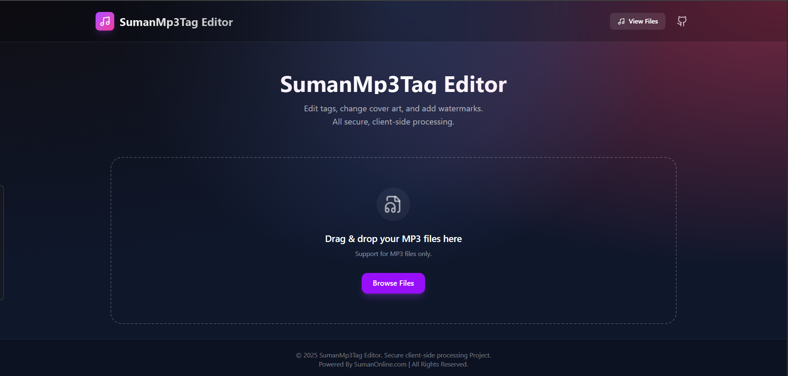

# SumanMp3Tag Editor


SumanMp3Tag Editor is a powerful, client-side web application designed for editing MP3 metadata (ID3 tags). Built with React, it offers a modern, user-friendly interface to manage your audio files' information securely without uploading them to a server.



## Features

### 🎵 Comprehensive Metadata Editing
Edit all standard ID3 tags including:
- **Title** (with auto-suffixing support)
- **Artist**
- **Album**
- **Genre**
- **Year**
- **Track Number**
- **Comment**
- **Album Artist**
- **Composer**
- **Copyright**

### 🖼️ Cover Art Management
- View existing cover art.
- Upload new cover art images directly from your device.
- **Watermarking Tool**: Add custom watermarks to your cover art.
    - **Positions**: Top, Center, Bottom.
    - **Colors**: Yellow, White, Red, Black.

### ⚡ Smart Automation
- **Auto-Suffixing**: Automatically appends " - SumanOnline.Com" to the song title if not present.
- **Smart Defaults**: Fills missing metadata fields with "SumanOnline.Com" branding to ensure consistent tagging.
- **Sanitized Filenames**: Automatically renames downloaded files based on the sanitized song title.

### 🔒 Secure & Client-Side
- **Zero Server Uploads**: All processing happens directly in your browser using WebAssembly technology. Your files never leave your device (unless you explicitly use the "Upload & Share" feature).
- **Fast Performance**: Built on Vite and React for a lightning-fast experience.

### 📤 Upload & Share
- Integrated support for uploading edited files to a server (requires a configured PHP backend).
- Generates shareable links for uploaded files.

## Technology Stack

- **Frontend**: [React](https://react.dev/)
- **Build Tool**: [Vite](https://vitejs.dev/)
- **Styling**: [Tailwind CSS](https://tailwindcss.com/)
- **Animations**: [Framer Motion](https://www.framer.com/motion/)
- **Icons**: [Lucide React](https://lucide.dev/)
- **Audio Processing**:
    - `browser-id3-writer`: For writing ID3 tags.
    - `jsmediatags`: For reading existing tags.
    - `@ffmpeg/ffmpeg`: For advanced audio handling (if enabled).

## Usage

1.  **Add Files**: Drag and drop MP3 files into the window or use the "Add Files" button.
2.  **Edit**: Click the "Edit" button on any file to open the metadata editor.
3.  **Modify Details**: Update tags, change the cover art, or apply a watermark.
4.  **Save/Download**: Click **Save & Download** to process the file and save it to your device.
5.  **Share** (Optional): Click **Upload & Share** to upload the file to your configured server.

### 📂 Uploaded Files Manager
A dedicated interface to manage files uploaded to your server.
- **Visual Browser**: View your uploaded library with cover art previews.
- **Smart Search**: Instantly filter files by Title, Album, Artist, or Filename.
- **Bulk Actions**: Select multiple files to **Download** or **Delete** them in batches.
- **Direct Access**: Get direct download links for any file.
- **Note**: This feature requires the included PHP scripts (`list_files.php`, `delete_file.php`, `upload.php`) to be hosted on a PHP-enabled server.

## Installation & Development

To run this project locally:

1.  **Clone the repository**:
    ```bash
    git clone https://github.com/SumanCH8514/SumanMp3Tag-Editor.git
    cd SumanMp3Tag-Editor
    ```

2.  **Install dependencies**:
    ```bash
    npm install
    ```

3.  **Start the development server**:
    ```bash
    npm run dev
    ```

4.  **Build for production**:
    ```bash
    npm run build
    ```

## License

This project is private and proprietary.
