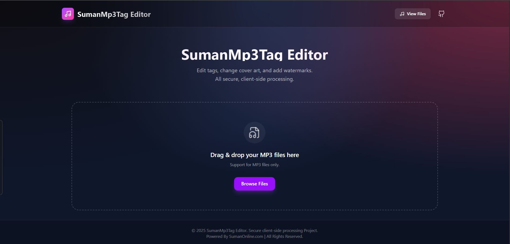

# 🎵 SumanMp3Tag Editor



### **A Premium, Private, and Powerful Music Metadata Management Suite.**

**SumanMp3Tag Editor** is a state-of-the-art web application designed for the modern music collector. Built with a focus on **privacy**, **speed**, and **aesthetic excellence**, it allows you to edit and manage your MP3 metadata (ID3 tags) directly in your browser. No files are uploaded during editing, ensuring your library remains 100% private.

---

## ✨ Core Features

### 🚀 **Advanced Single Metadata Editor**
Perfect for pinpoint accuracy on individual tracks.
- **Full Tag Support**: Edit Title, Artist, Album, Album Artist, Genre, Year, Track Number, Composer, Copyright, and more.
- **Smart Branding**: Automatically appends ` - SumanOnline.Com` to titles to ensure consistent library branding.
- **Sanitized Filenames**: Automatically suggests perfectly formatted, OS-compliant filenames based on your updated metadata.

### 📦 **Pro Batch Metadata Editor**
Process entire albums or playlists in seconds.
- **Multi-File Selection**: Upload dozens of files and manage them all at once.
- **Selective Overrides**: Our "Smart Rule" preserves existing metadata while applying default values only to missing fields.
- **Bulk Branding**: Apply consistent watermarks and suffixes across your entire batch with a single click.
- **Instant Previews**: See your branded filenames update in real-time as you process.

### 🖼️ **Cover Art Studio**
- **High-Resolution Support**: View and manage high-quality artwork.
- **Interactive Watermarking**: Add your signature branding to cover art. 
    - **Live Simulation**: Preview your watermark position (Top, Center, Bottom) and color (Yellow, White, Red, Black) in real-time.
- **Optimized Processing**: Ensuring your cover art looks crisp without bloating the file size.

### 📤 **Cloud Integration (Upload & Share)**
- **PHP Integration**: Seamlessly connect to your own server for storage.
- **Instant Sharing**: Once processed, files can be uploaded directly to generate shareable links for your audience.
- **Library Manager**: Browse and manage your server-side files through a sleek, visual interface.

---

## 💎 Design Philosophy

### **100% Private & Client-Side**
Leveraging the power of modern browsers, **SumanMp3Tag Editor** processes everything locally. Your files never leave your device unless you choose to use the cloud sharing features. 

### **Professional Aesthetics**
Experience a UI that feels like a premium desktop application.
- **Glassmorphism**: A sleek, translucent design with vibrant gradients.
- **Micro-Animations**: Powered by Framer Motion for a fluid, high-end feel.
- **Dark Mode Native**: Designed for comfort and style.

### **Fully Mobile Responsive**
From the main dashboard to the complex Batch Settings modal, the entire application is optimized for mobile devices, ensuring you can manage your library on the go.

---

## 🛠️ Technical Stack

- **Framework**: [React](https://react.dev/) for a reactive, component-based architecture.
- **Build Tool**: [Vite](https://vitejs.dev/) for ultra-fast performance.
- **Styling**: [Tailwind CSS](https://tailwindcss.com/) for a modern, utility-first design system.
- **Animations**: [Framer Motion](https://www.framer.com/motion/) for premium UI transitions.
- **Icons**: [Lucide React](https://lucide.dev/) for crisp, consistent iconography.
- **Metadata Libraries**:
    - `browser-id3-writer`: Industry-standard ID3 writing.
    - `jsmediatags`: Reliable tag reading from binary data.

---

## 🚀 Installation & Setup

To deploy or run SumanMp3Tag Editor locally:

### **1. Clone & Enter**
```bash
git clone https://github.com/SumanCH8514/SumanMp3Tag-Editor.git
cd SumanMp3Tag-Editor
```

### **2. Install Dependencies**
```bash
npm install
```

### **3. Launch Development Server**
```bash
npm run dev
```

### **4. Build for Production**
```bash
npm run build
```

---

## 🛡️ License & Rights

**SumanMp3Tag Editor** is a private and proprietary production by **SumanOnline.Com**. 
All rights reserved. Unauthorized reproduction or distribution is strictly prohibited.

---

<p align="center">
  <b>Built with ❤️ for Professionals and Music Enthusiasts.</b><br/>
  <i>© 2026 SumanOnline.Com</i>
</p>
